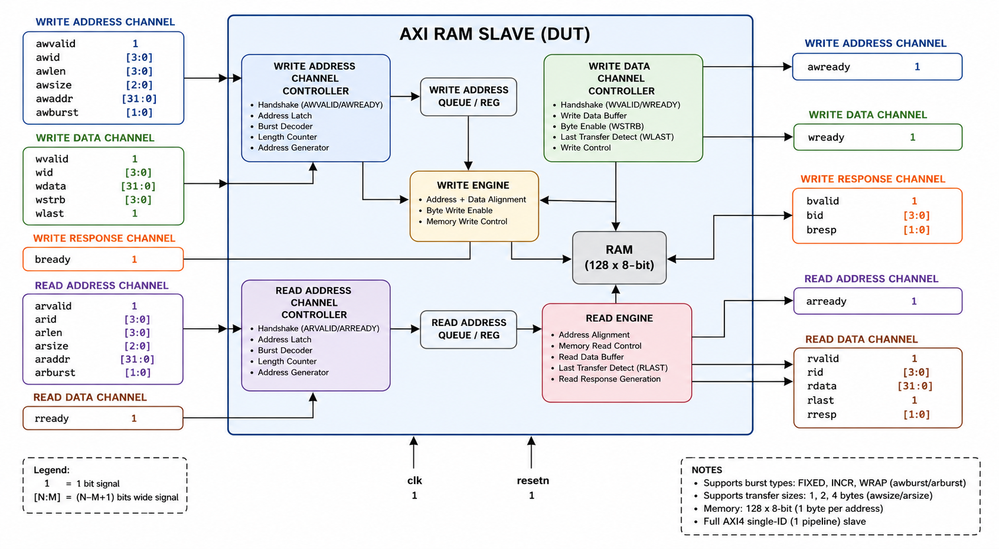
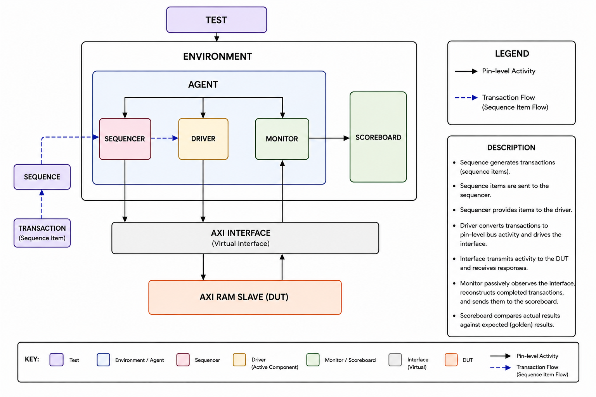
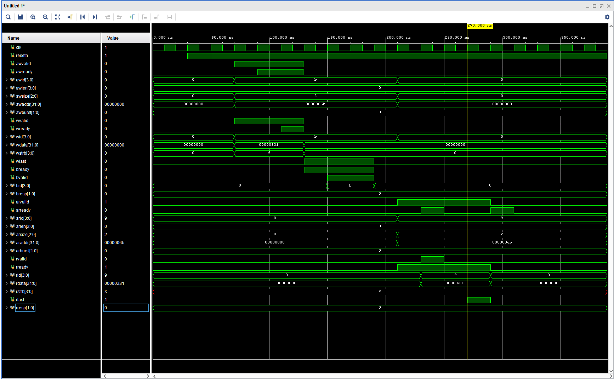

# AXI RAM UVM Verification

A reusable SystemVerilog UVM verification environment for an AXI4-compliant RAM slave featuring directed and constrained-random verification, automated scoreboarding, protocol-aware monitoring, and burst transaction verification.

---

# Overview

This project presents a **SystemVerilog UVM (Universal Verification Methodology)** environment developed to functionally verify a custom **AXI4 RAM slave** supporting multiple burst types, transfer sizes, and error handling.

The Design Under Test (DUT) implements a **128-byte memory** accessed through a simplified AXI4 interface. The verification environment generates both directed and constrained-random transactions, monitors all AXI channels, and automatically validates DUT functionality using a golden reference-memory scoreboard.

Unlike simpler bus protocols such as APB, AXI introduces independent address, data, and response channels together with burst transactions. Consequently, the primary goal of this project was not only to build a reusable UVM environment, but also to gain practical experience verifying a multi-channel protocol while debugging protocol timing, burst addressing, and transaction synchronization.

| Attribute | Value |
|-----------|-------|
| **Language** | SystemVerilog |
| **Methodology** | UVM 1.2 |
| **Protocol** | AXI4 |
| **Memory** | 128 × 8-bit |
| **Burst Types** | FIXED, INCR, WRAP |
| **Transfer Sizes** | 1-byte, 2-byte, 4-byte |
| **Verification Style** | Directed Testing, Constrained-Random, Self-checking Scoreboard |

---

# Project Structure

```text
AXI_RAM/
│
├── docs/
│   ├── verification_plan.md
│   └── images/
│       ├── AXI_architecture.png
│       ├── TB_Architecture.png
│       ├── AXI_write_read_waveform.png
│       └── AXI_burst_waveform.png
│
├── rtl/
│   └── AXI_RAM.sv
│
├── tb/
│   └── AXI_uvm_tb.sv
│
└── README.md
```

---

# Design Overview

The DUT implements a simplified AXI4 memory slave supporting burst-based read and write transactions.

<p align="center">
    
</p>

<p align="center">
<b>Figure 1.</b> AXI RAM RTL Architecture.
</p>

The slave accepts AXI read and write requests through independent address channels, performs memory accesses, and returns write responses or read data through the corresponding response channels. The memory is organized as a **128-byte storage array**, allowing byte, half-word, and word transfers using AXI burst transactions.

---

# Supported Features

### Write Channel

- AXI write address channel (AW)
- AXI write data channel (W)
- AXI write response channel (B)
- Byte-enable support using `WSTRB`

### Read Channel

- AXI read address channel (AR)
- AXI read data channel (R)

### Burst Modes

- FIXED Burst
- INCR Burst
- WRAP Burst

### Transfer Sizes

- 1-byte transfers
- 2-byte transfers
- 4-byte transfers

### Memory Operations

- Single-beat transfers
- Multi-beat burst transfers
- Configurable burst length

### Error Handling

- Invalid address detection
- Invalid transfer size detection
- AXI response generation (`BRESP`, `RRESP`)

---

# AXI Interface Summary

The DUT implements the five independent AXI channels shown below.

| Channel | Function |
|----------|----------|
| **AW** | Write address |
| **W** | Write data |
| **B** | Write response |
| **AR** | Read address |
| **R** | Read data |

Each channel follows the standard **VALID/READY handshake protocol**, allowing address, data, and response transfers to occur independently.

---

# Design Features Verified

The verification environment exercises all major DUT functionality, including:

- Reset behavior
- Single read/write transactions
- Burst transfers
- Burst address generation
- Multiple burst lengths
- Multiple transfer sizes
- Partial byte writes using `WSTRB`
- Invalid address handling
- Invalid transfer size handling
- Corner-case addresses
- Corner-case data values
- Read-before-write behavior
- Randomized AXI traffic


# UVM Testbench Architecture

The verification environment follows a standard reusable UVM architecture, separating stimulus generation, bus driving, passive monitoring, and functional checking into independent components.

<p align="center">
    
</p>

<p align="center">
<b>Figure 2.</b> UVM Testbench Architecture.
</p>

---

## Components

| Component | Description |
|-----------|-------------|
| **Transaction** | Defines an AXI transaction, including address, burst type, transfer size, burst length, write strobes, write data, read data, and response information. |
| **Sequence** | Generates directed and constrained-random AXI transactions. |
| **Sequencer** | Supplies sequence items to the driver. |
| **Driver** | Converts transactions into pin-level AXI bus activity while respecting AXI VALID/READY handshakes. |
| **Monitor** | Passively reconstructs completed AXI transactions from the DUT interface. |
| **Scoreboard** | Maintains a golden reference memory and automatically compares expected and actual read data. |
| **Agent** | Groups the driver, monitor, and sequencer into a reusable verification component. |
| **Environment** | Instantiates and connects the AXI agent and scoreboard. |
| **Test** | Executes verification sequences and configures simulation behavior. |

---

# Example AXI Transaction

<p align="center">
    
</p>

<p align="center">
<b>Figure 3.</b> Example AXI write transaction followed by a read transaction.
</p>

The waveform illustrates the independent AXI channels operating concurrently:

- Write address transfer (`AWVALID` / `AWREADY`)
- Write data transfer (`WVALID` / `WREADY`)
- Write response (`BVALID` / `BREADY`)
- Read address transfer (`ARVALID` / `ARREADY`)
- Read data transfer (`RVALID` / `RREADY`)

Unlike APB, these channels are independent and synchronize only through the AXI handshake protocol.

---

# Verification Strategy

The verification environment combines **directed testing** with **constrained-random verification** to validate both protocol behavior and memory functionality.

Each transaction generated by the sequences is driven onto the AXI interface, reconstructed by the monitor, and automatically checked by the scoreboard.

The verification strategy includes:

- Directed protocol testing
- Constrained-random transaction generation
- Burst transaction verification
- Automatic reference-memory checking
- Error-response verification
- Corner-case validation

The scoreboard maintains an internal reference memory representing the expected contents of the DUT throughout simulation.

For each monitored transaction:

- Successful write transactions update the reference memory.
- Read transactions compare DUT output against the expected reference value.
- Invalid transactions verify the appropriate AXI response signals.
- Reset transactions synchronize the scoreboard with the DUT before additional testing.

This self-checking methodology enables automatic detection of functional mismatches without manual waveform inspection.

---

# Verification Sequences

The verification environment includes both directed and constrained-random verification sequences.

## Basic Functional Tests

| Test | Description |
|------|-------------|
| Reset Test | Verify DUT reset behavior |
| Single Write Test | Verify a single AXI write transaction |
| Single Read Test | Verify a single AXI read transaction |
| Write-Read Test | Verify immediate readback after a successful write |

---

## Burst Transaction Tests

| Test | Description |
|------|-------------|
| FIXED Burst Test | Verify fixed-address burst transfers |
| INCR Burst Test | Verify incrementing burst transfers |
| WRAP Burst Test | Verify wrapping burst transfers |
| Transfer Size Test | Verify 1-byte, 2-byte, and 4-byte transfers |
| Burst Length Test | Verify multiple burst lengths |

---

## Robustness Tests

| Test | Description |
|------|-------------|
| Invalid Write Address Test | Verify write response for invalid addresses |
| Invalid Read Address Test | Verify read response for invalid addresses |
| Invalid Write Size Test | Verify illegal write transfer sizes |
| Invalid Read Size Test | Verify illegal read transfer sizes |

---

## Corner Case Tests

| Test | Description |
|------|-------------|
| Corner Address Test | Verify lowest and highest valid addresses |
| Corner Data Test | Verify minimum and maximum data values |
| Partial Strobe Test | Verify partial-byte write operations using `WSTRB` |
| Data Pattern Test | Verify common data patterns (0x00000000, 0xFFFFFFFF, etc.) |
| Read Before Write Test | Verify memory contents before any successful write |

---

## Random Regression

| Test | Description |
|------|-------------|
| Random Sequence | Constrained-random AXI transactions exercising burst type, burst length, transfer size, addresses, and data values. |

---

# Scoreboard Methodology

The scoreboard implements a golden reference memory that mirrors the expected behavior of the DUT.

## Write Transactions

For every successful AXI write:

- Update the reference memory.
- Apply byte enables (`WSTRB`).
- Compute the next burst address according to the burst type.
- Ignore transactions returning an AXI error response.

---

## Read Transactions

For every AXI read:

- Retrieve the expected data from the reference memory.
- Reconstruct the expected transfer according to the burst type and transfer size.
- Compare every beat of the burst against the DUT output.
- Report PASS or FAIL for each beat.

---

## Reset Handling

Upon reset:

- Synchronize the scoreboard with the DUT.
- Clear the reference memory.
- Ensure subsequent comparisons begin from a known state.

---

# Functional Verification Coverage

The implemented verification sequences exercise:

- AXI write transactions
- AXI read transactions
- Single-beat transfers
- Multi-beat burst transfers
- FIXED burst mode
- INCR burst mode
- WRAP burst mode
- Variable burst lengths
- Variable transfer sizes
- Partial-byte writes
- Invalid address handling
- Invalid transfer-size handling
- Boundary addresses
- Corner-case data values
- Reset behavior
- Read-before-write behavior
- Constrained-random regression testing

# Verification Results

The verification environment successfully exercised the major functional behaviors of the AXI RAM slave, including basic read/write operations, burst transactions, transfer-size variations, invalid transactions, boundary cases, and constrained-random traffic.

Several directed tests completed successfully, while more complex regression sequences exposed limitations and bugs in the DUT. These failures were analyzed using UVM logs, waveform inspection, and additional debug messages inserted into the RTL.

---

## Passing Test Cases

The following test cases completed successfully under the current DUT implementation:

| Test | Result |
|------|--------|
| Reset Test | Pass |
| Single Write Test | Pass |
| Single Read Test | Pass |
| Write-Read Test | Pass |
| FIXED Burst Test | Pass |
| INCR Burst Test | Pass when executed as an isolated transaction |
| WRAP Burst Test | Pass |
| Invalid Write Address Test | Pass |
| Invalid Read Address Test | Pass |
| Invalid Write Size Test | Pass |
| Invalid Read Size Test | Pass |
| Corner Address Test | Pass |
| Corner Data Test | Pass |
| Data Pattern Test | Pass |
| Read Before Write Test | Testbench reported pass, but exposed incorrect memory-reset behavior |

---

## Failing Test Cases

The following tests exposed known DUT issues:

| Test | Result | Primary Cause |
|------|--------|---------------|
| Transfer Size Test | Fail | INCR write address does not reliably advance between beats |
| Burst Length Test | Fail | Internal burst address state leaks between transactions |
| Partial Strobe Test | Fail | Address progression and strobe-related behavior expose DUT limitations |
| Random Regression Test | Fail | Combines multiple burst lengths, transfer sizes, and back-to-back transactions, exposing the known RTL issues |

---

# Known RTL Issues

## INCR Burst Address Boundary

The DUT originally validated only the starting address of an INCR burst.

For example, the condition:

```systemverilog
addr < 128
```

does not guarantee that later beats remain within the implemented 128-byte memory.

The transaction constraint was therefore updated to ensure that the complete INCR burst remains inside the legal address range:

```systemverilog
constraint c_addr {
    if (burst == 2'b01)
        addr + ((len + 1) * (1 << size)) <= 128;
    else
        addr < 128;
}
```

This prevents legal test traffic from generating unsupported out-of-range memory accesses.

A more complete RTL implementation should detect when any beat crosses the valid memory boundary and return an appropriate AXI error response.

---

## INCR Write Address Progression

The transfer-size and burst-length tests revealed that the DUT does not always advance the write address correctly between beats.

Debug output showed cases such as:

```text
DUT WRITE INCR: addr=103 wstrb=0011 wdata=be
DUT WRITE INCR: addr=103 wstrb=0011 wdata=157
```

For a 2-byte transfer, the second beat should have used address `105`.

Another example showed:

```text
DUT WRITE INCR: addr=84 wstrb=1111 wdata=3d5
DUT WRITE INCR: addr=84 wstrb=1111 wdata=d4
```

For a 4-byte transfer, the second beat should have used address `88`.

Because the address did not advance, the second beat overwrote the first beat, while the expected next memory locations remained unchanged.

The issue was traced to internal address-tracking variables such as:

```systemverilog
first
next_addr
return_addr
wlen_count
```

These variables were updated inside combinational logic even though they needed to retain their values across clock cycles.

---

## Internal Burst State Leakage

Single transactions often completed successfully, but multiple back-to-back transfers caused unexpected behavior.

One regression showed that the next address from a previous transfer was reused as the first address of a new transfer.

For example:

```text
Previous transfer:
start address = 56
next calculated address = 60

New transfer:
requested start address = 29
first write incorrectly used address = 60
```

This behavior indicates that internal burst state was not reinitialized correctly between separate AXI transactions.

This issue explains why some isolated INCR tests passed while multi-transaction tests such as burst-length and random regression failed.

---

## DUT Memory Not Cleared During Reset

The DUT declaration:

```systemverilog
reg [7:0] mem[128] = '{default:0};
```

initializes memory only once at simulation time zero.

It does not clear the memory array whenever reset is asserted.

As a result, data written by one test remained in memory after a later reset sequence.

This was exposed by running a pattern test followed by a read-before-write test. A value written before reset was still returned afterward.

A complete reset implementation should explicitly clear the memory array or clearly document that memory contents are preserved across reset.

---

# Verification Environment Improvements

## Transfer-Size-Aware Scoreboard

The original scoreboard assumed that every read beat contained four valid bytes.

This caused incorrect expected values for 1-byte and 2-byte transfers.

The expected read data was updated according to the AXI transfer size:

```systemverilog
case (tr_sco.size)

    3'd0: begin
        expected[7:0] = ref_mem[addr];
    end

    3'd1: begin
        expected[7:0]  = ref_mem[addr];
        expected[15:8] = ref_mem[addr + 1];
    end

    3'd2: begin
        expected[7:0]   = ref_mem[addr];
        expected[15:8]  = ref_mem[addr + 1];
        expected[23:16] = ref_mem[addr + 2];
        expected[31:24] = ref_mem[addr + 3];
    end

endcase
```

After this correction, the scoreboard correctly handled byte, half-word, and word transfers.

---

## Reference Memory Write Modeling

The scoreboard reference memory was updated to match the DUT's current strobe implementation.

The DUT packs enabled write bytes consecutively starting from the current address.

For example:

```systemverilog
WSTRB = 4'b0110
```

results in:

```text
data[15:8]  -> mem[addr]
data[23:16] -> mem[addr + 1]
```

The reference model was modified accordingly.

This behavior matches the current DUT implementation, although it differs from the normal AXI byte-lane interpretation of `WSTRB`.

---

## Corner-Data Constraint Handling

The transaction class originally constrained write data to:

```systemverilog
constraint c_data {
    foreach (data_q[i])
        data_q[i] inside {[0:1024]};
}
```

To test corner values such as:

```systemverilog
32'hFFFF_FFFF
```

the data constraint was disabled for the directed transaction:

```systemverilog
tr_wr.c_data.constraint_mode(0);
```

The transaction structure was randomized first, after which the directed data value was assigned:

```systemverilog
tr_wr.data_q[0] = data_value[i];
tr_wr.strb[0]   = 4'b1111;
```

This allowed the testbench to verify values outside the default constrained-random range.

---

## Transfer-Size Sequence Assignment Error

During development, the transfer-size sequence initially used the equality operator instead of the assignment operator:

```systemverilog
tr_wr.strb[i] == 4'b0011;
```

The corrected statement is:

```systemverilog
tr_wr.strb[i] = 4'b0011;
```

This was a testbench coding issue rather than a DUT failure.

---

## Reference Memory Reset and False Pass

The scoreboard reference memory originally retained data across reset.

Because the DUT memory also retained stale data, both the DUT and scoreboard contained the same incorrect values.

This caused the read-before-write test to report a false pass.

The scoreboard reset handling should clear the reference model:

```systemverilog
AXI_RESET: begin
    foreach (ref_mem[i])
        ref_mem[i] = 8'h00;

    `uvm_info(
        "SCO",
        "DUT reset detected; reference memory cleared",
        UVM_MEDIUM
    )
end
```

This issue demonstrates that a scoreboard can hide a DUT bug when both implementations share the same incorrect behavior.

---

# Verification Challenges

## Burst Address Calculation

Supporting FIXED, INCR, and WRAP burst modes required the driver, DUT, and scoreboard to use consistent address-generation rules.

For each beat, the expected next address depends on:

- Burst type
- Transfer size
- Burst length
- Starting address
- Wrap boundary

Incorrect or inconsistent address calculation can cause the DUT and scoreboard to disagree even when the data itself is correct.

---

## Transfer Size and Write Strobes

Supporting 1-byte, 2-byte, and 4-byte transfers required careful handling of both transfer size and `WSTRB`.

The scoreboard originally assumed full-word transfers, which caused false mismatches for smaller transfers.

Partial-strobe testing also showed that the DUT's implemented strobe behavior needed to be modeled explicitly in the reference memory.

---

## Multiple Back-to-Back Transactions

A major debugging lesson was that a DUT can appear correct when tested with isolated transactions but fail when internal state is exercised across multiple transfers.

The single INCR burst test passed, while the transfer-size and burst-length regressions exposed stale internal state and incorrect address progression.

This reinforced the importance of testing sequences of operations rather than only individual transactions.

---

## Distinguishing DUT Bugs from Scoreboard Bugs

Several failures initially appeared to be RTL issues but were partly caused by reference-model assumptions.

The debugging process required checking:

1. The sequence item generated by the test
2. The pin-level signals driven by the driver
3. The memory locations updated by the DUT
4. The transaction reconstructed by the monitor
5. The expected value generated by the scoreboard

Only after correcting the scoreboard's size and strobe handling was it possible to isolate the remaining failures as genuine DUT bugs.

---

## Reset Behavior

Reset verification exposed a subtle problem because both the DUT and scoreboard retained memory contents.

Since both models agreed, the testbench initially reported a pass.

This showed that reset verification must independently confirm architectural requirements rather than relying only on expected-versus-actual comparison.

---

# Lessons Learned

Through this project, I gained practical experience with:

- Building a reusable UVM verification environment for a multi-channel protocol
- Developing directed and constrained-random AXI transactions
- Implementing a reference-memory scoreboard
- Modeling FIXED, INCR, and WRAP burst address behavior
- Supporting variable burst lengths and transfer sizes
- Modeling partial writes using `WSTRB`
- Verifying invalid addresses and transfer sizes
- Debugging state leakage across back-to-back transactions
- Using UVM logs and waveforms together to isolate failures
- Distinguishing testbench bugs from RTL bugs
- Understanding how a scoreboard can produce a false pass
- Developing tests that expose bugs not visible in isolated transactions

The most important lesson from this project was that passing basic directed tests does not guarantee that the design is functionally correct.

The DUT successfully completed several isolated read, write, and burst tests. However, transfer-size, burst-length, and randomized regressions exposed internal state-retention and address-progression bugs.

The project also demonstrated that the verification environment itself must be validated. Incorrect assumptions in the scoreboard can create false failures, while shared errors between the DUT and reference model can create false passes.

---

# Future Improvements

Potential improvements to the verification environment include:

- Functional coverage collection
- Coverage-driven constrained-random verification
- SystemVerilog Assertions for AXI protocol handshakes
- Assertions for burst length and `RLAST`/`WLAST` behavior
- Assertions for stable signals while `VALID` is asserted
- Randomized backpressure using `READY`
- Additional reset assertions
- Support for multiple outstanding AXI transactions
- Functional use of AXI transaction IDs
- Improved AXI-compliant `WSTRB` behavior
- More complete error handling for bursts crossing the memory boundary
- Refactoring DUT state variables into sequential logic
- Clearing or formally defining memory contents during reset
- UVM Register Abstraction Layer support
- Automated regression scripts
- Functional and code coverage closure

---

# Tools

- SystemVerilog
- Universal Verification Methodology (UVM 1.2)
- AMD Xilinx Vivado Simulator
- VS Code
- Git
- GitHub